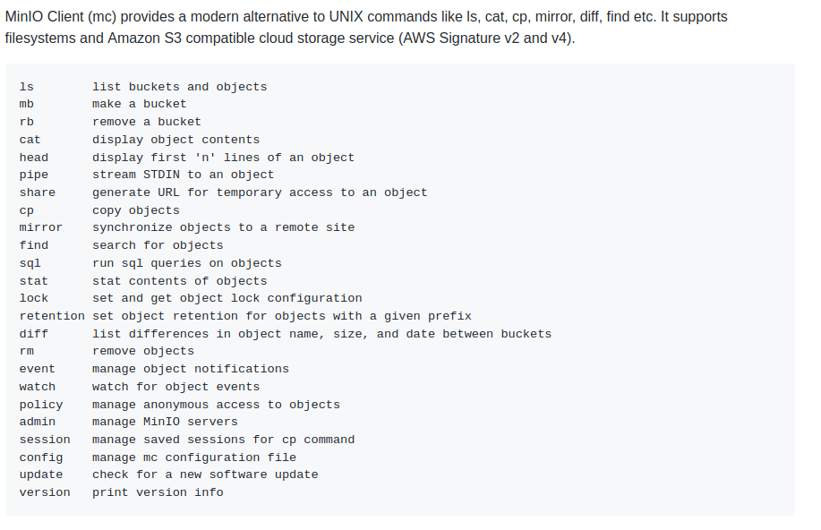
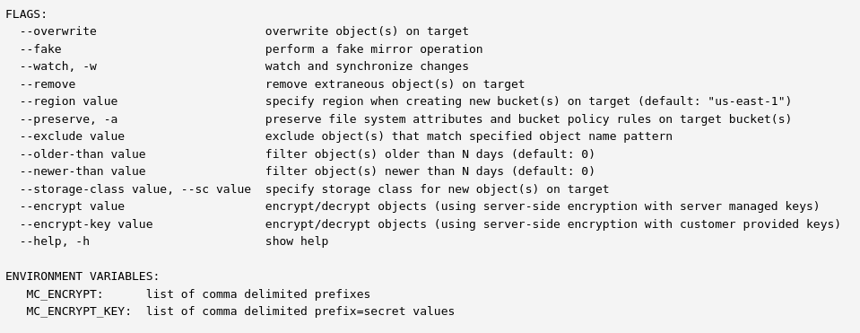

# BackSE

A GitHub action to mirror a repository to S3 compatible object storage. This has been implemented using **mirror** command of [MinIO Client](https://github.com/minio/mc). Please refer MinIO client. A **screenshot** is attached below too.



## Usage of the action

- Given below is an example that will mirror your repository to an **S3 bucket** called **backup-bucket**. We can also add path to it (optional) **/a/b/c**.
- Objects present at the given mirror taeget will be overwritten.
- This default usage keeps your **S3 bucket** backup in sync with GitHub.
- More paramters can be passed using the `args` parameter. They are mentioned [here](https://docs.min.io/docs/minio-client-complete-guide.html) or can be found below.



```yml
    - name: S3 Backup
      uses: sayak119/back-se@v1
      env:
        ACCESS_KEY_ID: ${{ secrets.ACCESS_KEY_ID }}
        SECRET_ACCESS_KEY: ${{ secrets.SECRET_ACCESS_KEY }}
        MIRROR_TARGET: backup-bucket/a/b/c
      with:
        args: --overwrite
```

## ENV variables and keys

These variables or keys can be added to the GitHub action.

- `ACCESS_KEY_ID` (**required**) - The storage service access key id.
- `SECRET_ACCESS_KEY` (**required**) - The storage service secret access key.
- `MIRROR_TARGET` (**required**) - The target bucket, and optionally, the key within the bucket.
- `MIRROR_SOURCE` - The source defaults to the repository root. You can also set a path relative to the root.
- `STORAGE_SERVICE_URL` - The URL to the object storage service. Default value is `https://s3.amazonaws.com` for S3.
- `STORAGE_SERVICE_ALIAS` - Defaults to `s3`.

## IAM user policy

The IAM user associated with the `ACCESS_KEY_ID` and `SECRET_ACCESS_KEY` should have `s3:*` policy access.

The following policy grants the user access to the bucket `myExampleBucket` and its contents. Policies can be modified to restrict access. You can refer [here](https://aws.amazon.com/blogs/security/how-to-restrict-amazon-s3-bucket-access-to-a-specific-iam-role/), [here](https://aws.amazon.com/blogs/security/iam-policies-and-bucket-policies-and-acls-oh-my-controlling-access-to-s3-resources/) or [here](https://docs.aws.amazon.com/AmazonS3/latest/dev/s3-access-control.html).

```
{
    "Version": "2012-10-17",
    "Statement": [
        {
            "Sid": "AllowBucketStat",
            "Effect": "Allow",
            "Action": [
                "s3:HeadBucket"
            ],
            "Resource": "*"
        },
        {
            "Sid": "AllowThisBucketOnly",
            "Effect": "Allow",
            "Action": "s3:*",
            "Resource": [
                "arn:aws:s3:::myExampleBucket/*",
                "arn:aws:s3:::myExampleBucket"
            ]
        }
    ]
}
```

## Workflow example

Given below is a **workflow** example that filters `push` events for the `master` branch before mirroring to S3 bucket.

```yml
name: Mirror repo to S3
on:
  push:
    branches:
      - master
jobs:
  s3Backup:
    runs-on: ubuntu-latest
    steps:
      - uses: actions/checkout@v2
      - name: Back SE
        uses: sayak119/back-se@v1
        env:
          ACCESS_KEY_ID: ${{ secrets.ACCESS_KEY_ID }}
          MIRROR_TARGET: ${{ secrets.MIRROR_TARGET }}
          SECRET_ACCESS_KEY: ${{ secrets.SECRET_ACCESS_KEY }}
        with:
          args: --overwrite --remove
```

## License

[MIT](LICENSE)
